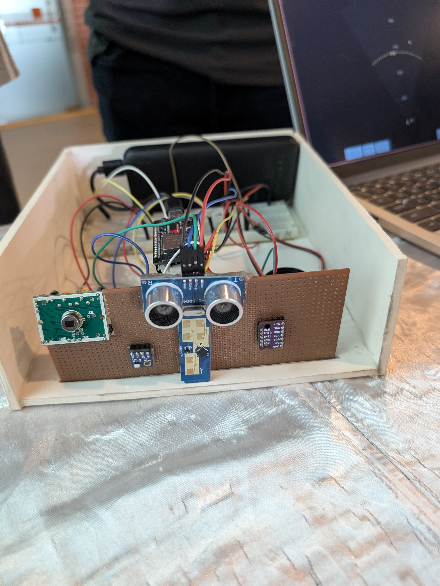
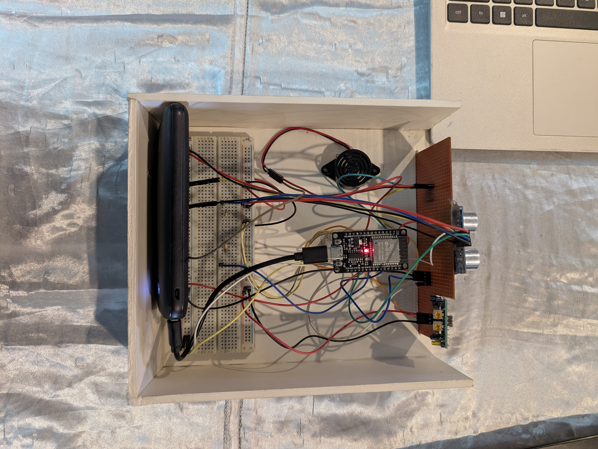
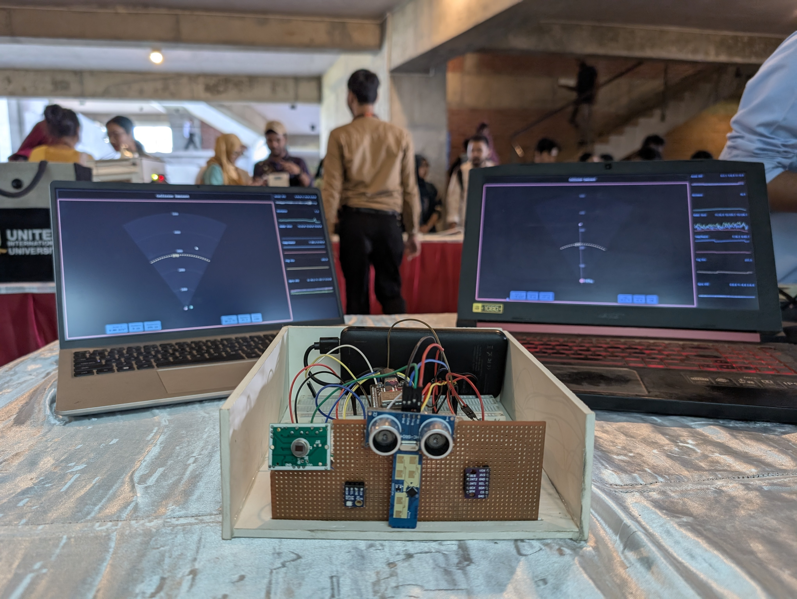
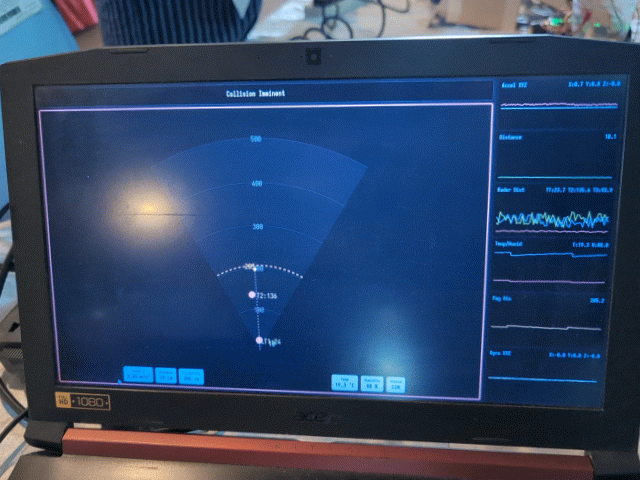

# SpectraFog

A smart automotive assistance system that retrofits older vehicles with advanced environmental sensing and collision detection capabilities.

## Overview

SpectraFog is a prototype device designed to enhance vehicle safety by providing real-time environmental monitoring and hazard detection. The system transforms conventional vehicles into smart cars through an external sensor array and intuitive web interface.

## Features

The system combines PIR, ultrasonic, and mmWave sensors for reliable object detection in adverse weather conditions, particularly fog. Temperature and humidity sensors calculate visibility conditions, while an integrated accelerometer and gyroscope detect vehicle speed and provide alerts based on environmental visibility and detected obstacles. The device includes a buzzer for debugging and critical alerts, and provides a wireless web-based dashboard.

## Hardware Components

The device is built around an ESP32 microcontroller and includes PIR motion sensor, ultrasonic distance sensor, mmWave radar sensor, temperature and humidity sensor, accelerometer and gyroscope (IMU), buck converter for power regulation, buzzer, and battery power supply.

## Installation

Position the device in front of the vehicle and power it on. Connect to the SpectraFog WiFi network and navigate to `10.10.10.10` in your browser to monitor environmental conditions and proximity alerts through the web interface.

## Use Cases

SpectraFog provides enhanced safety during fog and low-visibility conditions, collision avoidance assistance for older vehicles, and real-time environmental and obstacle monitoring.

## Status

This is a prototype developed as an electronics project demonstration.

## License

This project is released into the public domain under the Unlicense.
